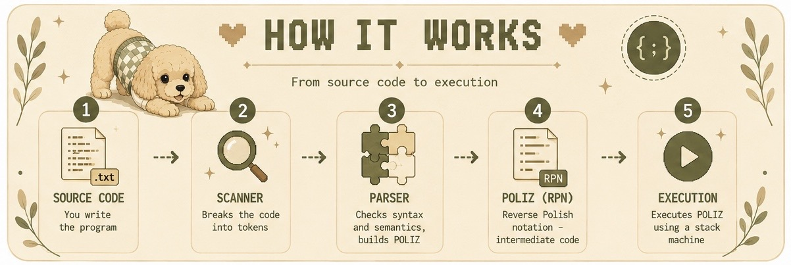

# INTERPRETER
<p align="center">
  
</p>

A custom interpreter for a simple programming language implemented in C++.

## Features
### Data types:
- int
- bool
- string
- struct
### Control flow:
- if, else
```text
program {
    int x = 10;
    if (x > 0) {
        write("positive");
    }
    else {
        write("non-positive");
    }
}
```
- while
```text
program {
    int i = 0;
    while (i < 5) {
        write(i);
        i = i + 1;
    }
}
```
- for
```text
program {
    int i = 0;
    for (i = 0; i < 5; i = i + 1) {
        write(i);
    }
}
```
- break
```text
program {
    int i = 0;
    while (i < 10) {
        if (i == 5) {
            break;
        }
        write(i);
        i = i + 1;
    }
}
```
- goto
```text
program {
    int x = 0;
start:
    write(x);
    x = x + 1;
    if (x < 3) {
        goto start;
    }
}
```
### Operations:
- arithmetic operations

```text
program {
    int a = 10;
    int b = 3;

    write(a + b);
    write(a - b);
    write(a * b);
    write(a / b);
    write(a % b);
}
```

- comparison operations

```text
program {
    int a = 10;
    int b = 3;

    write(a == b);
    write(a != b);
    write(a < b);
    write(a > b);
    write(a <= b);
    write(a >= b);
}
```

- logical operations

```text
program {
    bool x = true;
    bool y = false;

    write(x and y);
    write(x or y);
    write(not x);
}
```

- string operations

```text
program {
    string first = "Hello, ";
    string second = "world!";

    write(first + second);
    write(first == second);
    write(first != second);
}
```

- assignment

```text
program {
    int x = 5;
    x = x + 10;
    write(x);
}
```

- input / output

```text
program {
    int x;
    read(x);
    write("Input value:");
    write(x);
}
```


<p align="center">
  
</p>

## Build
```bash
g++ interpreter.cpp -o interpreter
```

## Run
```bash
./interpreter program.txt
```
## Testing
```bash
./run_all.sh ./interpreter
```

<p align="center">
  
</p>
